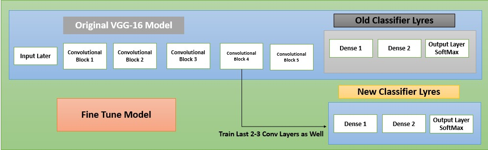
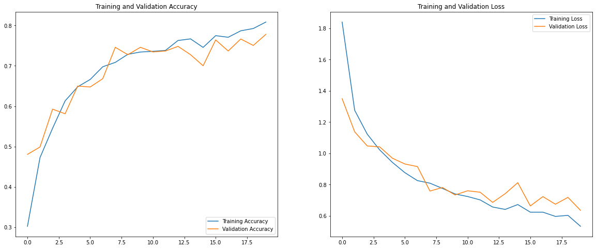

# Problem Statement
The problem is preety much stright forward, we all are famelier with Garbage and waste material which is very harmful for our society.if we talk about amount of waste then the world almost generates at least 5 million tons of waste per day and this number is still increasing day by day that's why we need to aware about waste. This model which help us to classify waste with 7 different waste materials and it will show you the details of that particular waste materials. This will help to raise awareness for people to reduce and recycle waste.

## Overview
- There are 'cardboard', 'compost', 'glass', 'metal', 'paper', 'plastic', 'trash' total 7 different types of waste materials which are use for recycling.
- Here i have 2187 images belonging 7 classes.
- Here i have trained dataset using VGG16,RESNET50 model via using Transfer Learning technique of CNN for classification.
- Here i have trained this model till 5 epochs and i got 41.31% accuracy on training data and 43% on testing data. Since my computer can not aford more epochs at this time due unavailbility of GPU. if you have good ammount of gpu you can train more than 50 epochs if you want to improve ac curacy.

---
## Introduction of Tranfer Learning and Fine Tuning

  

---

  

---
## VGG16 Architeture using Tranfer Learning
### Loss Plot of VGG16

  

### Accuracies Plot of VGG16

  

---
## ResNet50 Architeture using Tranfer Learning
### Loss Plot of ResNet50

  

### Accuracies Plot of ResNet50

  

---

## Improve VGG-16 using Tranfer Learning
### Loss and Acuuracy Plot of VGG-16 with TF

  

## Improve VGG-16 using Fine Tuning
### Loss and Acuuracy Plot of VGG-16 with FT

  

---

## Evaluation Matrix of VGG16 and ResNet50 Model

| Model Name       |Test Accuracy | Epochs | For improve accuracy |
| ---------------- | ------------- | ------ | -------------------- |
| VGG-16 with TL    |     43.03%    |   5    |    Set 100 Epochs    |
| ResNet-50 with TL |     29.78%    |   5    |    Set 100 Epochs    |
| Improvement of VGG-16 with TL |     72.5%    |   20    |    Tune more HT    |
| Improvement of VGG-16 with TL+FT |     80.8%    |   25    |    Tune more HT    |
